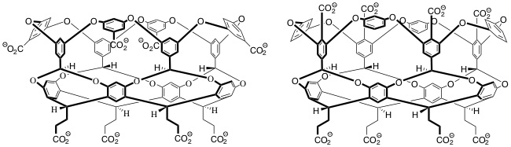
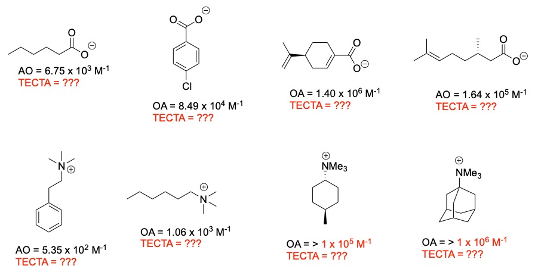

# The SAMPL7 GDCC Challenge

For SAMPL7, the Gibb group is **tentatively** contributing binding data for eight
guests to two of the Gibb Deep Cavity Cavitand (GDCC) hosts it has frequently studied ---
the familiar "Octa Acid" (OA) host and a newer, TECTA host as detailed below.

## Challenge timing details (preliminary)

Currently, as of May 1, 2019, the Gibb group needs several weeks to check scale up of synthesis of the TECTA host to finalize host selection.
Following this, the guest set will be finalized and the challenge will be opened for predictions.
Data collection is expected to be completed within three months, which means the
challenge will likely close (with experimental data released) by the end of summer or early fall 2019.

## Proposed challenge for SAMPL7: A Coulombic Challenge

The two hosts shown below, OA (left) and TECTA (right) differ only in the placement of the four water-solubilizing groups.
In the former they are remote from the non-polar pocket, whilst in the latter they are appended directly at the rim of the pocket.

The Gibb group will examine the binding of eight guests: four negatively charged, and four positively charged.
As previously, all binding constants will be determined in sodium phosphate buffer at pH 11.5.
The guests have been selected to partially overlap with previous determinations for binding to OA (Ka values in black below).  These six examples will act as a reference point for the other determinations.  There will be two new determinations for binding to OA (estimated Ka shown in red), as well as eight new determinations for TECTA (unknown Ka values shown as red question marks.)  Each of the ten new determinations will be carried out in triplicate using ITC.

Given the identity of these guests, it is likely we will be able to have *some* overlap between the GDCC guests and those used in the modified cyclodextrin (Gilson lab) and acyclic CB (Isaacs lab) portions of the challenge.

### Additional technical details

Tentatively, buffer conditions will be 10 mM sodium phosphate, but this will be confirmed as data collection begins. The plan is to gather data in triplicate with fresh solutions of host and guest on each occasion.  Also, all hosts samples are probed by one of either two ways to determine the waters of hydration in each sample.  This can be as high so this analysis is a requirement to avoid bad data.

For positively charged guests, chloride salts are expected to be used.

# What's here

All files here so far are extremely tentative pending finalization.
- Hosts: `OA.pdb` and `TECTA.pdb` provided by Paolo Suating (Tulane) April 26, 2019; `SAMPL7_tentative_hosts.cdx` provided by Bruce Gibb April 26, 2019.
- Guests: `SAMPL7_tentative_guests.cdx` provided by Bruce Gibb April 26, 2019.
