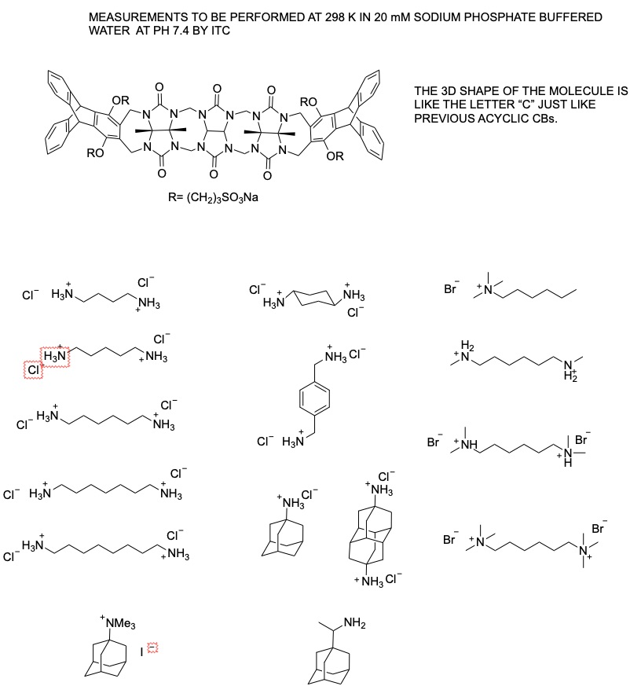

# The SAMPL7 TrimerTrip Challenge

For SAMPL7, the Isaacs group is contributing binding data for roughly ten guests to a CB-like clip molecule highlighted in the attached documents. This host is codenamed TrimerTrip.

## Challenge timing details (preliminary)

Currently, as of May 1, 2019, the Isaacs group is trying to ensure a broad range of binding affinities and finalizing guest selection for roughly 10 guests, to be completed in the next two weeks or so.
Following this, the challenge is expected to launch around June 1, 2019, with experimental data potentially available for release as of August 1. Depending on calculation timescales a submission deadline may be set later than that, though input on this is welcome.

## A quick view of the host and guests

# What's here

- Hosts: `host_files`: Folder containing PDB, MOL2, SDF and Chemdraw files for the TrimerTrip host. Contains a detailed description of input file generation for the TrimerTrip host.
- Guests: `guest_files`: Folder containing files for the 15 guests, SMILES strings, and the jupyter notebook used to generate PDB, MOL2 and SDF files of the guests.
- Images: `images`: Folder containing an image of the guest and host structures for this challenge in JPG file format.
