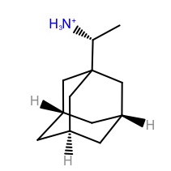

# The SAMPL7 Modified Cyclodextrin Challenge

For SAMPL7, the Gilson group is contributing binding data for two hosts (r-rimantadine and trans-3-methylcyclohexanol) binding to beta-cyclodextrin as well as nine novel cyclodextrin derivatives synthesized by Gilson postdoc Katy Kellett. 

Above, R-rimantadine

Above, trans-3-methylcyclohexanol

## Challenge timing details (preliminary)

Currently, as of May 10, 2019, Dr. Kellett has collected most of the ITC data on guest binding and expects to have data collection finalized very soon. Participants may begin their calculations (though we will be preparing additional structures/inputs for those who would like additional file formats) and submissions will be allowed as soon as our submission system is online. The challenge is expected to run through August, 2019, with experimental results released at that time. (The formal submission deadline will be announced soon.)

## Background information

This section is under construction and will provide background details on these systems in the near future.

### Additional technical details

Binding in all systems was assayed in 25 mM pH 6.8 sodium phosphate buffer. All systems exhibit 1:1 binding except that one may end up being a nonbinder. NMR is being done in the hopes of assessing whether compounds are binding to the primary or secondary face.
Compounds exhibiting strange binding patterns have already been removed prior to construction of this set.

# What's here

- Hosts: `hosts`: Folder containing beta cyclodextrin plus the nine other hosts, provided by Katy Kellett and Michael Gilson, initially only in PDB format with all protons present.
- Guests: `guests`: Initially containing only names/SMILES strings of guests, but to be expanded with `mol2`/`sdf` files additionally.
