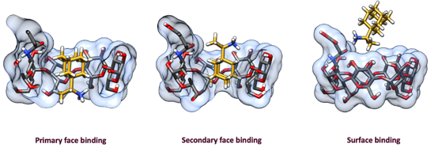

# SAMPL7 Host-Guest Systems and Measurements and Starting Files

## Gibb Deep Cavity Cavitand (GDCC) binding of guests

Instructions are available in the [host guest instructions](host_guest_instructions.md) and full details are in the [README.md of the `GDCC_and_guests` directory](GDCC_and_guests/README.md).

## Modified acyclic cucurbituril (TrimerTrip) binding of guests

Instructions are available in the [host guest instructions](host_guest_instructions.md) and full details are available in the [README.md of the `Isaacs_clip` directory](Isaacs_clip/README.md).

## The cyclodextrin derivatives challenge

Instructions are available in the [host guest instructions](host_guest_instructions.md). Details on the experiments and molecules follow.

### Structures of Guest Molecules
Two guest molecules were used: trans-4-methylcyclohexanol and R-rimantadine hydrochloride (below).

**Figure 1** - *Structures of two guest molecules used with assigned stereochemistry*

### Host Molecules
Host structures have been provided in pdb format with the correct stereochemistry and charge state where applicable.
All host molecules were synthesized in the Gilson group, and purity was assessed using LC-MS and NMR before binding studies were conducted.

### Table 1 - The nine host molecules used in this data set, with their chemical name and charge state.

| Host Code | Chemical Name | Charge state |
| --------- | ------------- | ------------ |
| b-CD      | β-cyclodextrin | 0     |
| MGLab8    | Mono-3-(3-carboxypropionamido)-β-cyclodextrin | -1 |
| MGLab9 | Mono-3-(4-oxobut-2-enoic acid)-α-cyclodextrin | -1 |
| MGLab19 | Mono-3-glycine-β-cyclodextrin | +1 |
| MGLab23 | Mono-3-(3-carboxypropionamido-glutathione)-β-cyclodextrin | -2 |
| MGLab24 | Mono-3-(3-carboxypropionamido-lysine)-β-cyclodextrin | 0 |
| MGLab34 | Mono-6-β-tyrosine-β-cyclodextrin | +1 |
| MGLab35 | Mono-6-(carboxypropionamido)-β-cyclodextrin | -1 |
| MGLab36 | Mono-3-cholic acid-β-cyclodextrin | 0 |

### Standard Experimental Conditions

All ITC results have been collected in duplicate on an ITC200 in phosphate buffer (sodium counterion, no potassium), pH 6.8, 25mM at 27℃ with a 16 point binding isotherm (2.42µL injections).
Enthalpograms will be provided for each complex.
In each case the host was in the cell and the guest in the syringe.
Concentrations of solutions varied for each complex depending on binding affinity.

R-rimantadine hydrochloride has a reported purity of 95%, trans-4-methylcyclohexanol is 98% and the host molecules all has a reported purity of ≥ 95%.
The purity was taken into account when calculating concentrations of all solutions.
β-Cyclodextrin has a reported 8 hydration water molecules, therefore this was also taken into account when calculating host concentrations.

Binding was found to be 1:1 stoichiometry for all complexes and inside the binding cavity (i.e. no surface binding).
However ITC results do not confirm primary vs. secondary binding orientation (for example see Figure 2, below).
Note, that primary/secondary binding orientations may not exchange on simulation timescales, meaning that part of this challenge may include binding mode prediction.

**Figure 2** - *Different potential 1:1 binding orientations of guest molecules (specifically rimantadine) and a modified cyclodextrin.*

Analysis was conducted using code written within the Gilson group, made publicly available at https://github.com/GilsonLabUCSD/itc_fit commit ID `e9eabb0`, which treats N (stoichiometry) as floating.  

### Key Papers for Understanding Cyclodextrin Binding
- Rekharsky, M. V.; Mayhew, M. P.; Goldberg, R. N.; Ross, P. D.; Yamashoji, Y.; Inoue, Y. Thermodynamic and Nuclear Magnetic Resonance Study of the Reactions of α- and β-Cyclodextrin with Acids, Aliphatic Amines, and Cyclic Alcohols. J. Phys. Chem. B 1997, 101(1), 87–100. https://doi.org/10.1021/jp962715n
- Henriksen, N. M.; Gilson, M. K. Evaluating Force Field Performance in Thermodynamic Calculations of Cyclodextrin Host-Guest Binding: Water Models, Partial Charges, and Host Force Field Parameters. J. Chem. Theory Comput.2017, 13(9), 4253–4269. https://doi.org/10.1021/acs.jctc.7b00359
- Carrazana, J.; Jover, A.; Meijide, F.; Soto, V. H. Complexation of Adamantyl Compounds by β-Cyclodextrin and Monoaminoderivatives. J. Phys. Chem. B2005, 109(19), 9719–9726. https://doi.org/10.1021/jp0505781
- Kellett, K.; Kantonen, S. A.; Duggan, B. M.; Gilson, M. K. Toward Expanded Diversity of Host-Guest Interactions via Synthesis and Characterization of Cyclodextrin Derivatives. J. Solution Chem.2018. https://doi.org/10.1007/s10953-018-0769-1.
- Kantonen, S. A.; Henriksen, N. M.; Gilson, M. K. Evaluation and Minimization of Uncertainty in ITC Binding Measurements: Heat Error, Concentration Error, Saturation, and Stoichiometry. Biochim. Biophys. Acta - Gen. Subj. 2017, 1861(2), 485–498. https://doi.org/10.1016/j.bbagen.2016.09.002
