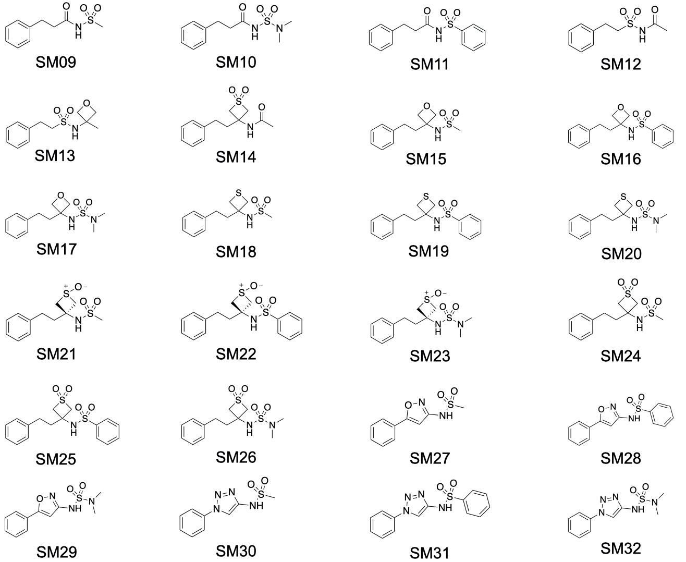

# The SAMPL7 physical property challenge
We are excited to announce a new set of SAMPL7 challenges focusing on pKa, partitioning, and permeability. [The Ballatore group at UCSD](https://pharmacy.ucsd.edu/faculty/ballatore) is contributing a set of measured water-octanol log *P*, log *D*, and pKa values for 22 compounds. They also provide PAMPA permeability values they measured.

pKa prediction will consist of predicting relative free energies between compound microstates. The partitioning prediction will focus on predicting the octanol-water partition coefficients. Our subsequent analysis will later combine participant-predicted pKa and log *P* values to obtain estimated distribution coefficients, which will also be compared against experimental values. Additionally, an optional PAMPA permeability prediction challenge will be run in parallel to the pKa and partition coefficient challenge. Participants may participate in this challenge additionally, separately, or not at all.

Please sign up for our [e-mail list](https://mailchi.mp/272a7816e925/sampl7-physical-properties) for announcements of any changes. Be sure to also “watch” this GitHub repository.

## Challenge timing details
The SAMPL7 physical property challenge design will be finalized shortly (as of June 29, 2020) and further details will be made available in this repository. Submissions will be due September 30, 2020. The challenge will consist of predicting relative free energies between microstates to determine pKa, partition coefficients, and (optionally) permeabilities of 22 compounds. We choose free energies rather than pKa values given the recent work of [Gunner et al.](https://link.springer.com/content/pdf/10.1007/s10822-020-00280-7.pdf)

Submission details and a submission template will be posted here at a slightly later date.

## A view of the compounds

**Fig 1. SAMPL7 Challenge molecules.** Log of the partition coefficient between n-octanol and water was determined via potentiometric titrations using a Sirius T3 instrument. pKa values were determined by potentiometric titrations using a Sirius T3 instrument. Log of the distribution coefficient between n-octanol and aqueous buffer at pH 7.4 were determined via potentiometric titrations using a Sirius T3 instrument, except for compounds SM13, SM14, SM16-SM20, SM22-SM25 which had log *D*7.4 values determined via shake-flask assay. PAMPA assay data includes effective permeability, membrane retention, and log of the apparent permeability coefficient. Permeabilities for compounds SM19, SM21, and SM25 were not determined. Compounds SM09 and SM10 were used as controls and will not be analyzed in the challenge.

## Experimental details
Compounds were synthesized by the Ballatore Lab at UC San Diego in 1-6 steps and were >95% pure as indicated by NMR and LCMS.
pKa measurements were obtained via automated potentiometric titrations using a Sirius T3 instrument (Pion, Inc). Three titrations were performed from pH 1.8 to pH 12.2 using ionic strength adjusted water (0.15 M KCl), acid (0.5 M HCl, 0.15 M KCl) and base (0.5 M KOH, 0.15 M KCl). The pKas of select compounds (Compounds SM16 and SM25) with low aqueous solubility were measured using a cosolvent protocol; Yasuda-Shedlovsky extrapolation method was used to estimate the pKa at 0% cosolvent.

Log *P* measurements of compounds with known experimental pKa were obtained via potentiometric titrations using a Sirius T3 instrument. Log *D*7.4 values were extrapolated from the measured log *P*. Log *D*7.4 of select compounds with pKa > 10 (Compounds SM13, SM14, SM16, SM17, SM18, SM19, SM20, SM22, SM23, SM24, SM25) were measured via shake-flask method (shake-flask log *D*7.4 carried out by Analyza, Inc).

Melting points of the crystalline material were taken using Mel-Temp II (Barnstead Thermolyne). Crystals were grown by slow evaporation in a single solvent (dichloromethane) or by vapor diffusion (hexanes/dichloromethane or dichloromethane/methanol). Intrinsic solubilities were obtained using the experimental log *P* and the melting point via Yalkowski intrinsic solubility equation (log *S* = –log *P* – 0.01 ´ (mp – 25) + 0.5).

Effective permeability (log *P*app) was measured by Parallel Artificial Membrane Permeability Assay (PAMPA) using the Corning GentestTM pre-coated PAMPA plate system with quantitation by HPLC-UV (experiments carried out by Analyza, Inc).

## What's here
*Under construction*
- `SAMPL7_molecule_ID_and_SMILES.csv` - CSV file containing SAMPL7 challenge molecule IDs and SMILES provided by the Ballatore lab. Note, compounds SM09 and SM10 were experimental controls and will not be analyzed in the challenge, but they are still provided here.
- `log P`: Folder will be updated soon to contain challenge input files, instructions and a submission template.
- `pKa`: Folder will be updated soon to contain challenge input files, instructions and a submission template.
- `permeability`: Folder will be updated soon to contain challenge input files, instructions and a submission template.
- `images`: Folder containing images of the molecules for this challenge in PDF and JPEG format.
