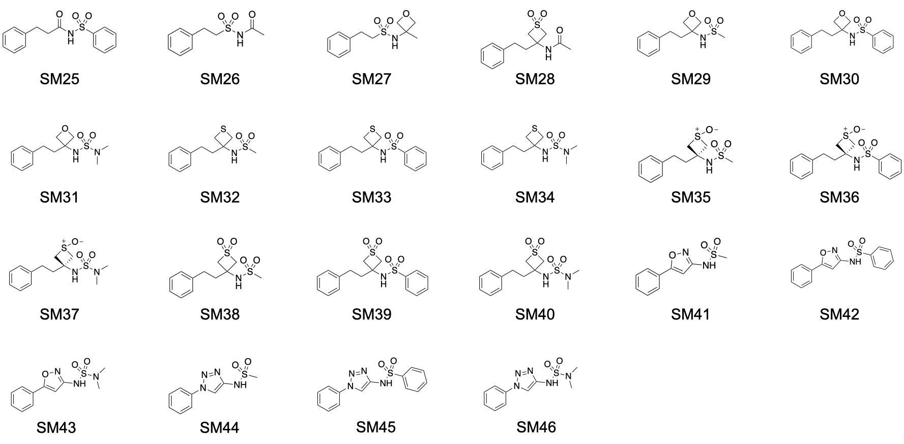

# The SAMPL7 physical property challenge
We are excited to announce a new set of SAMPL7 challenges focusing on pKa, partitioning, and permeability. [The Ballatore group at UCSD](https://pharmacy.ucsd.edu/faculty/ballatore) is contributing a set of measured water-octanol log *P*, log *D*, and pKa values for 22 compounds. They also provide PAMPA permeability and melting point values they measured.

pKa prediction will consist of predicting relative free energies between compound microstates. We choose free energies rather than pKa values given the recent work of [Gunner et al.](https://link.springer.com/content/pdf/10.1007/s10822-020-00280-7.pdf). For the purposes of the pKa challenge all possible tautomers of each ionization (charge) state are defined as distinct protonation microstates. The partitioning prediction will focus on predicting the octanol-water partition coefficients. As a part of post prediction analysis challenge oraginzers will combine participant-predicted pKa and log *P* values to obtain estimated distribution coefficients, which will also be compared against experimental values. A [PAMPA permeability](https://pubs.acs.org/doi/10.1021/jm970530e) prediction challenge will also be run in parallel to the pKa and partition coefficient challenge.
All three challenges are optional, so participants may participate in all or any combination of these challenges.

Additionally, there’s the opportunity to predict melting points. Please let us know if you are interested in this. For predictions, participants may use these [SMILES strings](SAMPL7_molecule_ID_and_SMILES.csv). Enumerated microstates are also found [here](pKa/microstates).

Please sign up for our [e-mail list](https://mailchi.mp/272a7816e925/sampl7-physical-properties) for announcements of any changes. Be sure to also “watch” this GitHub repository.

## Challenge timing details
The SAMPL7 physical property challenge design **will be finalized shortly** and further details will be made available in this repository. Submissions will be due September 30, 2020. Challenge participants will have the option of predicting relative free energies between microstates to determine pKa[1](https://link.springer.com/content/pdf/10.1007/s10822-020-00280-7.pdf), and/or partition coefficients, and/or permeabilities of 22 compounds.

Submission details and a submission template will be posted here at a slightly later date.

## A view of the compounds

**Fig 1. SAMPL7 Challenge molecules.** Log of the partition coefficient between n-octanol and water was determined via potentiometric titrations using a Sirius T3 instrument. pKa values were determined by potentiometric titrations using a Sirius T3 instrument. Log of the distribution coefficient between n-octanol and aqueous buffer at pH 7.4 were determined via potentiometric titrations using a Sirius T3 instrument, except for compounds SM27, SM28, SM30-SM34, SM36-SM39 which had log *D*7.4 values determined via shake-flask assay. PAMPA assay data includes effective permeability, membrane retention, and log of the apparent permeability coefficient. Permeabilities for compounds SM33, SM35, and SM39 were not determined.

## Experimental details
Compounds were synthesized by the Ballatore Lab at UC San Diego in 1-6 steps and were >95% pure as indicated by NMR and LCMS.
pKa measurements were obtained via automated potentiometric titrations using a Sirius T3 instrument (Pion, Inc). Three titrations were performed from pH 1.8 to pH 12.2 using ionic strength adjusted water (0.15 M KCl), acid (0.5 M HCl, 0.15 M KCl) and base (0.5 M KOH, 0.15 M KCl). The pKas of select compounds (Compounds SM30 and SM39) with low aqueous solubility were measured using a cosolvent protocol; Yasuda-Shedlovsky extrapolation method was used to estimate the pKa at 0% cosolvent.

Log *P* measurements of compounds with known experimental pKa were obtained via potentiometric titrations using a Sirius T3 instrument. Log *D*7.4 values were extrapolated from the measured log *P*. Compounds with pKa > 10 had log *D*7.4 measured via shake-flask method (shake-flask log *D*7.4 carried out by Analyza, Inc).

Melting points of the crystalline material were taken using Mel-Temp II (Barnstead Thermolyne). Crystals were grown by slow evaporation in a single solvent (dichloromethane) or by vapor diffusion (hexanes/dichloromethane or dichloromethane/methanol). Intrinsic solubilities were obtained using the experimental log *P* and the melting point via Yalkowski intrinsic solubility equation (log *S* = –log *P* – 0.01 ´ (mp – 25) + 0.5).

Effective permeability (log *P*app) was measured by Parallel Artificial Membrane Permeability Assay (PAMPA) using the Corning GentestTM pre-coated PAMPA plate system with quantitation by HPLC-UV (experiments carried out by Analyza, Inc).

## What's here

- [`SAMPL7_molecule_ID_and_SMILES.csv`](SAMPL7_molecule_ID_and_SMILES.csv): A `.CSV` file containing SAMPL7 challenge molecule IDs and SMILES. SMILES were provided by the [Ballatore lab](https://pharmacy.ucsd.edu/faculty/ballatore).
- [`logP`](logP): Folder contains an input file in `.CSV` format with SMILES strings of the neutral states of the molecules. This folder will be updated soon to contain instructions and a submission template.
- [`pKa`](pKa): Folder contains input files and will be updated soon to contain instructions and a submission template.
- [`permeability`](permeability): Folder contains input files in `.CSV` format with SMILES of enumerated microstates. This folder will be updated soon with instructions and a submission template.
- [`images`](images): Folder containing images of the molecules for this challenge in PDF and JPEG format.
- [`experimental_data`](experimental_data): Folder will contain experimental measurements of pKa, partitioning, permeability and melting point values after the SAMPL7 challenge submission deadline.

## Publication on experimental measurements
Karol R. Francisco, Thomas J. Paniak, Marisa C. Kozlowski, and Carlo Ballatore. "Structure Property Relationships of N-Acylsulfonamides and Related Bioisosteres" *(Details to be announced)*
