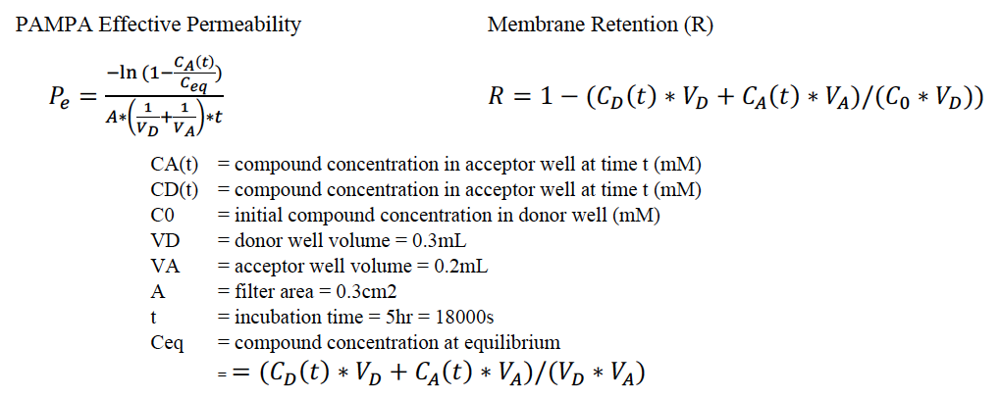

## PAMPA permeability Challenge Instructions

A submission template file can be found in the [submission_template/](submission_template/) directory and an example submission file can be found in [submission_template/](example_submission_file/).

For each molecule, we are asking participants to predict the log of the apparent permeability coefficient  log*P**app*. Experimental PAMPA permeability measurements include effective permeability and membrane retention.

- Fill one [`submission_template/permeability_prediction_template.csv`](submission_template/permeability_prediction_template.csv) template for all molecules predicted with one method. You may submit predictions from multiple methods, but you should fill a separate template file for each different method.

- You may report only 1 log*P**app* value per molecule per method.

- It is mandatory to submit predictions for all molecules except `SM33`, `SM35`, and `SM39`, which are optional (since values were not determined). Incomplete submissions will not be accepted.

- Report log*P**app* values to two decimal places (e.g. 3.71).

- Report the standard error of the mean (SEM) as a measure of statistical uncertainty (imprecision) for your method. The SEM should capture variation of predicted values of the same method over repeated calculations.

- Report the model uncertainty of your difference in free energy prediction --- the predicted accuracy of your method [1,9]. This is not a statistical uncertainty. Rather, the model uncertainty is an estimate of how well your predicted values are expected to agree with experimental values. For example, for classical simulation approaches based on force fields, this could measure how well you expect the force field will agree with experiment for this compound. The model uncertainty could be global or different for each molecule. For example, reference calculations in SAMPL5 log D challenge estimated the model uncertainty as the root mean squared error (RMSE) between predicted and experimental values for a set of molecules with published cyclohexane-water partition coefficients.

- Lines beginning with a hash-tag (#) may be included as comments. These and blank lines will be ignored during analysis.

- The file must contain the following four components in the following order: your predictions, a name for your computational protocol (that is 40 characters or less), a list of the major software packages used, prediction method category, and a long-form methods description. Each of these components must begin with a line containing only the corresponding keyword: `Predictions:`, `Name:`, `Software:`, `Category:`, and `Method:`, as illustrated in the example files. An example submission files can be found [here](example_submission_file/permeability-DanielleBergazinExampleFile-1.csv) to illustrate expected format when filling submission templates.

- For Method Category section please state if your prediction method can be better classified as an empirical modeling method, physical quantum mechanics (QM) modeling method, physical molecular mechanics (MM) modeling method, or mixed (both empirical and physical), using the category labels `Empirical`, `Physical (MM)`, `Physical (QM)`, or `Mixed`. Empirical models are prediction methods that are trained on experimental data, such as QSPR, machine learning models, artificial neural networks etc. Physical models are prediction methods that rely on the physical principles of the system, such as molecular mechanics or quantum mechanics based methods to predict molecular properties. If your method takes advantage of both kinds of approaches please report it as “Mixed”. If you choose the “Mixed” category, please explain your decision in the beginning of Method Description section.

- Names of the prediction files must have three sections separated by a `-`: predicted property `permeability`, and your name and must end with an integer indicating the number of prediction set. For example, if you want to submit one prediction, you would name it `permeability-myname-1.csv`, where `myname` is arbitrary text of your choice. If you submit three prediction files, you would name them `permeability-myname-1.csv`, `permeability-myname-2.csv`, and `permeability-myname-3.csv`.

- Prediction files will be machine parsed, so correct formatting is essential. Files with the wrong format will not be accepted.

## Experimental details
Effective permeability (log*P**app*) was measured by Parallel Artificial Membrane Permeability Assay (PAMPA) using the Corning GentestTM pre-coated PAMPA plate system with quantitation by HPLC-UV (experiments carried out by Analyza, Inc).

Samples were prepared as DMSO stock solutions and sonicated in a 40°C water bath to facilitate dissolution. Dilutions (50-fold) of the DMSO stocks were prepared in PBS, 7.4 for a dose concentration of 200μM in a volume of 300μL directly in the Donor compartment of the Corning GentestTM Pre-coated PAMPA plate. After preparation of the Donor plate, any precipitation was noted. The Acceptor compartment was filled with 1xPBS (200μL), pH 7.4. After PAMPA plate assembly, it was incubated for five hours in the dark at ambient temperature. A sister plate was created (50x dilution of 10mM test articles was prepared in 1xPBS, pH 7.4) directly in a Millipore solubility filter plate to measure the initial concentration of the sample in buffer (C0). Following incubation, the PAMPA plate was disassembled, and the samples were transferred from the Donor and Acceptor plates to 96-well plates for analysis. The C0 plate was filtered prior to analysis

The concentration values from the Donor and Acceptor compartment are used in the calculation of the effective permeability (Pe) of the compound. A mass balance equation is used to calculate the amount of compound retained in the membrane (%R). A high %R indicates either that the compound is bound to the PAMPA membrane, or that the compound is precipitating in the donor compartment. The equations for permeability and membrane retention are shown below. Note that the Ballatore lab experimentally determined Co, instead of assuming the full solubility of the compound. Pe values less than 1.5E-6 cm/s correlate with human fraction absorbed (%FA) less than 80%, a generally accepted cutoff for low permeability.

## Computational prediction methods
You may use any method(s) you like to generate your predictions; e.g., molecular mechanics or quantum mechanics based methods, QSPR, empirical pKa prediction tools etc.

## Submission of multiple predictions
Some participants use SAMPL to help evaluate various computational methods. To accommodate this, multiple prediction sets from a single research group or company are allowed, even for the same type of predictions if they are made by different methods. If you would like to submit predictions from multiple methods, you should fill a separate submission template files for each different method.

## References
[1] Bannan, Caitlin C., Kalistyn H. Burley, Michael Chiu, Michael R. Shirts, Michael K. Gilson, and David L. Mobley. “Blind Prediction of Cyclohexane–water Distribution Coefficients from the SAMPL5 Challenge.” Journal of Computer-Aided Molecular Design 30, no. 11 (November 2016): 927–44.

[2] Comer, John, and Kin Tam. Lipophilicity Profiles: Theory and Measurement. Wiley-VCH: Zürich, Switzerland, 2001.
